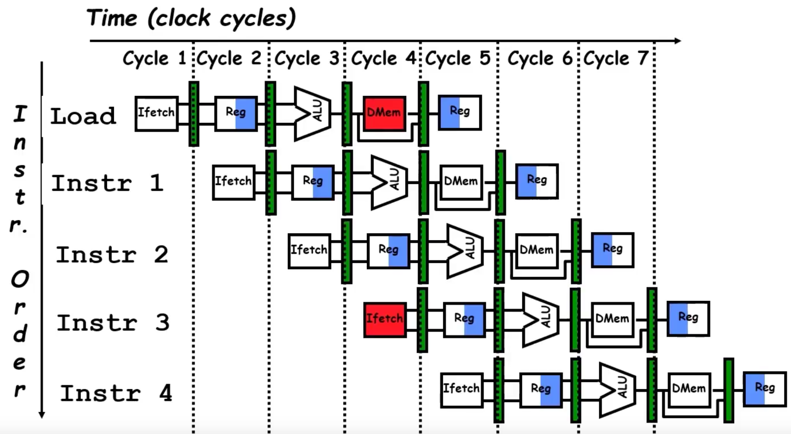
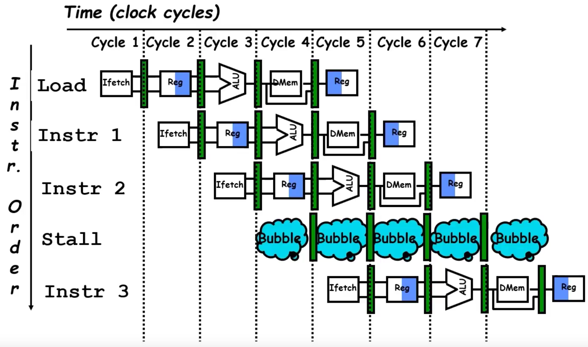
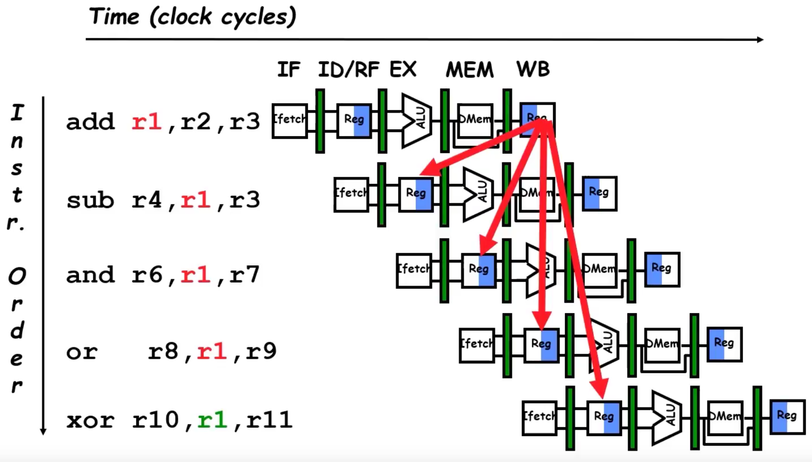
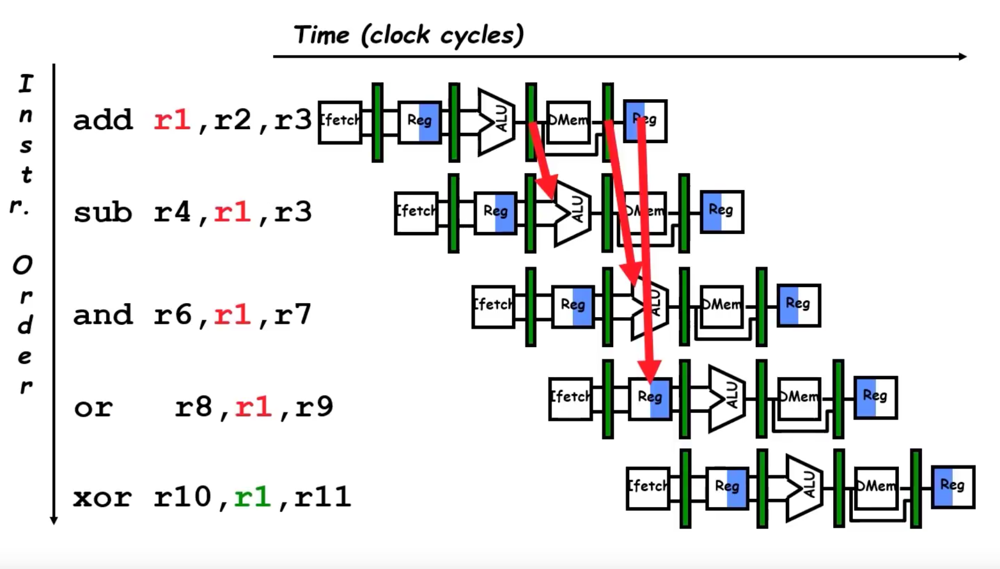
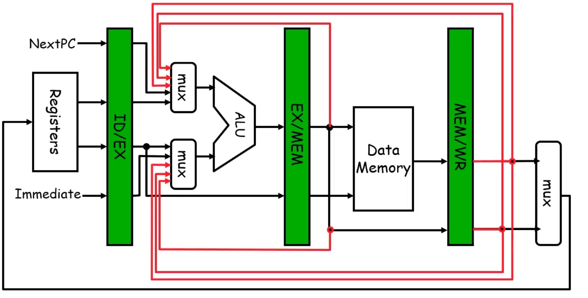
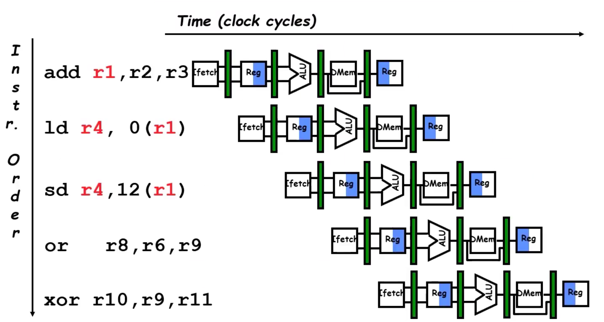
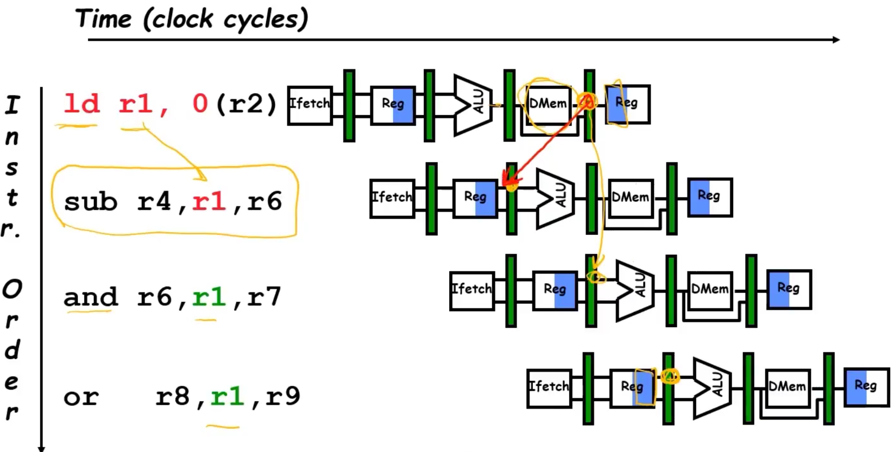
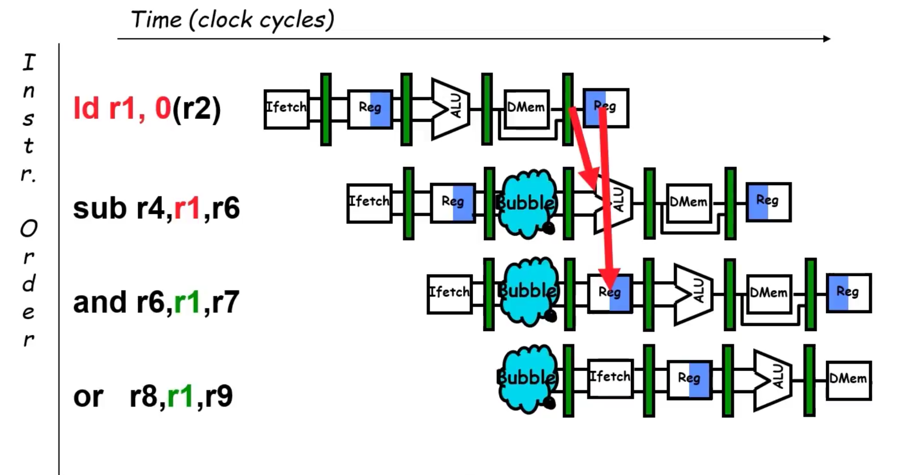
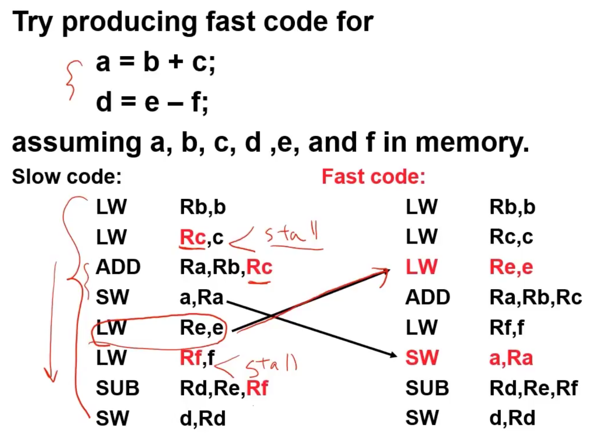

### Visualizing Pipeline


- As we can see, we start a new instruction every clock cycle
- However, pipelining is not that easy...  
  **Why? Hazards.**

---

### Pipeline Hazards
Limits to pipelining:
- Hazards prevent the next instruction from executing during its designated clock cycle.

#### Types of Hazards
1. **Structural Hazards**
   - Hardware cannot support this combination of instructions.  
     **Example**:
     - Single person folding and putting clothes away. Since the hardware (person) is busy folding, putting clothes away has to wait.
  
2. **Data Hazards**
   - Instruction depends on the result of a prior instruction still in the pipeline.  
     **Example**:
     - Branch/control statements need to wait until the condition is resolved.

3. **Control Hazards**

---

### One Memory Port/Structural Hazards



- Since there is only one memory port, we can't write to memory and read from memory at the same time.  
  **How to fix?**  
  - Have two memory ports or use NO-OPs to wait until the hazards are solved.

- Most modern CPUs have separate caches for data and instruction, eliminating the NO-OP stalls.

**Updated Pipeline to Avoid Structural Hazards**  



---

### Speedup Equation for Pipelining
- CPI -> "Cycles per instruction"  
  We want CPI = 1:1 (1 instruction per cycle).

```plaintext
CPI(pipelined) = Ideal CPI + Average Stall cycles per Inst
Speedup = (Ideal CPI(unpipelined)) / (Ideal CPI + Pipeline stall CPI) * CycleTime(unpipelined) / CycleTime(pipelined)

For simple RISC Pipeline, CPI = 1:

Speedup = Pipeline Depth / (1 + Pipeline stall CPI)

    Pipeline Depth for RISC-V = 5. Ideal speedup = 5x, but hazards reduce it.
```

### Data Hazard on R1



- Remember, a structural hazard is when 2, or more, instructions want to use the same hardware at the same time 

What if we had instructions such as:
1. add r1, r2, r3 
2. sub r4, r1, r3 
3. and r6, r1, r7 
4. or r8, r1, r9
5. xor r10, r1, r11 

Problem: We are using the value in register r1, a lot  

- Clearly we have to wait until the value @ r1 is updated by instruction 1
- Instruction 3 needs to wait until instruction 1 is finished 
- Instruction 4 needs to wait until instruction 1 is finished
- Instruction 5 needs to wait until instruction 1 is finished
    - However, Instruction 1 is not finished until the instruction fetch of Instruction 5...
        - So the only non-data-hazard instruction pairs are (1,5), but also (1,4)
        
        - Explanation for (1,5) 
            - Look at when instruction 1 writes back to memory.
            - Now look at when instruction 5 reads the data from memory... it's the next clock cylce after r1 has been updated 
            - Thus it's in the clear. 
        
        - Explanation for (1,4)
            - This one is a little harder to spot why it isn't a data hazard 
            - It's not because the sequence in whcih RISC-V reads and writes data 
            - Write on rising edge, read on falling edge 
                - Thus Instruction 1 will be finished writing, and then shortly after the data will be read on instruction 4 
                
- Data hazards on all the other instruction pairs (1,2) and (1,3)

### Forwarding to Avoid Data Hazard 
- What do we do to fix the data hazard?
    - In reality, the value for r1 is finished after the ALU stage... so is there a way we can forward that value to the other instructions 
        rather than reading it from a register? 

    Yes! 




### Hardware Change for Forwarding



- If we are going to forward from the buffer (represented by the green rectangles) to the ALU, we need to add some sort of detection logic 

- Essentially:
    - If the value of a register needs to be accessed before it's able to be written to memory:
        - 1. It will skip over (forwarded) the Data Memory and go straight to the write back buffer 
        - 2. The value will also be forwarded back to the ALU stage for use in other instructions

    With this hardware change we are able to avoid all data hazards that involve ALU operations  

### Forwarding to Avoid LW-SW Data Hazard 



- Although the hardware change fixes all ALU data hazards, we still have some for loading 
- As we can see in the photo, Instructions 3 and 4 are good, but we have an issue with instruction 1 and 2 
- Since we are loading r1 with a new value, 0(r2), the value won't be avaliable until after the DMem stage.
    - Why? The ALU is not responsible for the value we need in instruction 2.
        - The ALU is just performing the calculation as to where to grab the new r1 value.
        - It's not until after stage 4 is R1 updated 
    
- First why are the instruction pairs (1,3) and (1,4) not hazards?
    - Well, instruction 4 reads the data in R1 after it's been updated, so we're good there 
    - Instruction pair (1,3) is a little harder to spot, but similar to (1,4) 
        - Since the value of R1 is written to first, since RISC-V writes on rising edge, we can actually read it on the same clock cycle's falling edge 
            Thus, no data-hazard 


    - How do we fix this?

    
        
    - The value of R1 is always updated after. There is never a situation to where it can be forwarded.
            Thus we have to STALL

    - However, it is only one cycle of stalling.

    

    - Sometimes people call this a delayed store 
        - Always a 1 CC stall for load 

### Software Scheduling to Avoid Load Hazards   
- There is a way to bypass the stall for load and that is to change the order of which the instructions are processed 



```plaintext
    Note:
        - A stall is needed if we load B, then C, then immediately do the add operation.
        - Sinec a load takes one CC, why not load E as well, then do the add operations after all the loading is finished for b and c?
            - This way we would load b, c, AND e, then do the add operation on b and c
        
    THIS IS CALLED SOFTWARE SCHEDULING AND IS VERY IMPORTANT FOR OPTIMIZATION 
```

### 3 Generic Data Hazards 
```plaintext
    1. Read after Write (RAW)
        I: add r1, r2, r3 
        J: sub r4, r1, r3 

        Instr(J) tries to read operand before Instr(I) writes it 
            - Caused by a Dependence." Instruction J depends on Instruction I to be finished before starting 
            - This hazard results from an actual need for communication 

    2. Write after Read (WAR)
        I: sub r4, r1, r3 
        J: add r1, r2, r3 
        K: mul r6, r1, r7 

        Instr(J) writes operand before Instr(I) reads it 
            - In the RISC-V pipeline we saw this wouldn't be possible
            - In chpt 3 we will see where sometimes this is the case.
                Example:
                    - Say Instr(I) is waiting on R3 
                    - Sometimes Instr(J) can be ran first b/c of Out-of-Order execution 
                        - If this is the case, then r1 will be updated before Instr(I) starts 
            
            - Caused by "anti-dependence" by compiler writers. This results from reuse of the name "r1"

        -Some other computer architectures have a WAR hazard, but RISC-V typically doesn't 
        - Can't happen in MIPS 5 stage pipeline because:
            - All isntructions take 5 stages
            - Reads are always in stage 2
            - Writes are always in stage 5
                Thus there are 3 CCs between writing and reading 
            - Not always the case in other architectures

    3. Write After Write (WAW)
        I: sub r1, r4, r3 
        J: add r1, r2, r3 
        K: mul r6, r1, r7 

        Instr(J) writes operand before Instr(I) writes it 

        - Called an "output dependence." This also results from the reuse of the name "r1"
        - Can't happen in MIPS 5 stage pipeline because:
            - All instructions take 5 stages 
            - Writes are always stage 5 
                - Can't have Instr(J)'s write happen before Instr(I) unless Out-of-Order instruction execution which RISC-V doesn't have (I think)
        
    - We will see WAR and WAW in other complicated pipelines 
```