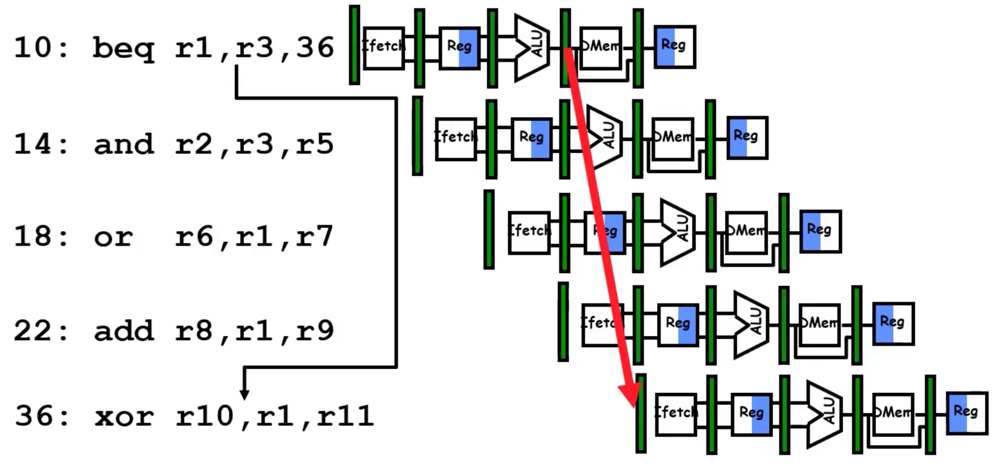
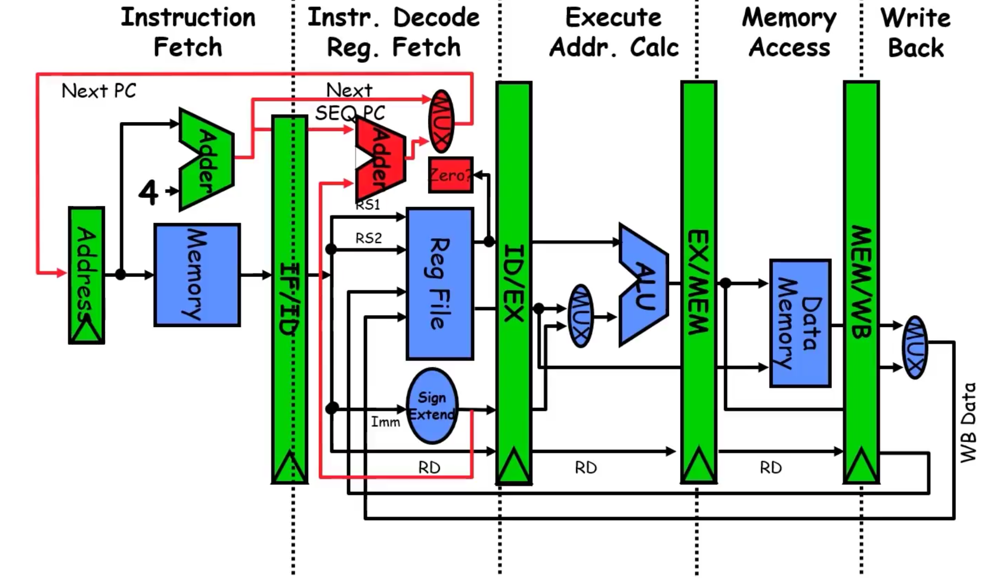
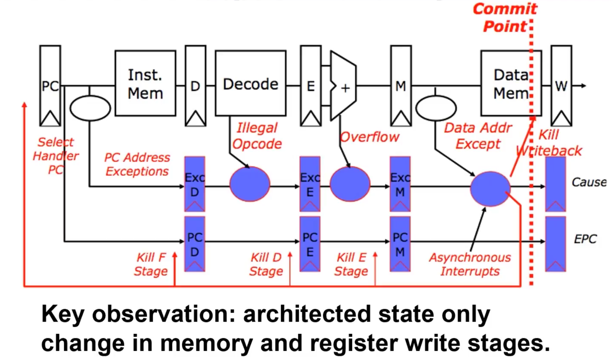

### Control Hazards
- Happen on branches (switch statements, if, for, etc).

#### Control Hazard on Branches: Three Stage Stall



Since there is a branch where `r3 == 36`, we must wait until the instruction finishes after the ALU stage.
- After the ALU, the result (whether they are equal or not) will have been determined.
  - What do we do with the 3 instructions in-between?
  - We forward this result to later instructions.
  - Until then, we need to have stalls.

**Summary**:
- Every time there is a branch, we stall for 3 clock cycles.

#### Branch Stall Impact
- If CPU = 1, 30% branch:  
  - Stall 3 cycles = new CPI = 1.9.
  
**Two-part solution**:
1. Determine branch taken or not sooner.
2. Compute taken branch address earlier.

**RISC-V solution**:
- RISC-V branch tests if register == 0 or != 0.
- Move zero test to ID/RF stage.
- Add adder to calculate new PC in the ID/RF stage.
- Results in 1 CC penalty for branch vs. 3.



#### Four Branch Hazard Alternatives
1. **Stall 1 clock cycle**.
2. **Predict Branch Not Taken**.
   - Execute successor instructions in sequence.
   - "Squash" instructions in pipeline if branch is taken.
   - Late pipeline state update allows this.
   - 47% of MIPS branches are not taken on average.
   - PC + 4 already calculated, so use it for the next instruction.
  
   **Note**: When writing software instructions, branches should be written in a way where they are least likely to be taken.

3. **Predict Branch Taken**.
   - 53% of MIPS branches are taken on average.
   - However, the branch target address hasn't been calculated in MIPS, so MIPS incurs a 1 cycle branch penalty.
   - Other architectures: branch target known before the outcome.

4. **Delayed Branch**.
   - Define the branch to take place **after** a following instruction.
   - Similar to load instructions.
   - 1 slot delay allows for proper decision and branch target address in a 5-stage pipeline (used by MIPS).

**Explanation**:
- Instead of performing `beq` immediately followed by the next instruction, the compiler finds an independent instruction to execute during the delay.
- Once the branch is determined, the CPU jumps or continues execution as needed.

---

#### Scheduling Branch Delay Slots
A. **From before the branch**:
```plaintext 
    A. From before branch 
        Before compiler optimizations:
            1. add $1, $2, $3  
            2. if $2=0 then ------------+
                - delayed slot          |
            ...                         |
            ...                         |
            ...                         |
            ...                         |
            10.     - Branch target  <--+

        After:
            1. if $2=0 then 
            2. add $1, $2, $3

    B. From branch target

        Before compiler optimizations:
            1. sub $4, $5, $6 
            ...
            ...
            ...
            ...
            10. add $1, $2, $3
            11. if $1=0 then 

        After:
            ...
            ...         <-------+
            ...                 |
            ...                 |
            ...                 |
            add $1, $2, $3      |
            if $1=0 then -------+
            sub $4, $5, $6

    C. From fall through 
        Before compiler optimizations:
            1. add $1, $2, $3 
            2. if $1=0 then 
                - delayed slot 
                ...
                ...
                ...
            10. add $14, $15, $16
            11. sub $4, $5, $6

        After:
            add $1, $2, $3 
            if $1=0 then 
            add $14, $15, $16 
            ...
            ...
            sub $4, $5, $6

    Notes:
        A is the best choice, fills delay slot and reduces instruction count 
        In B, the sub instruction may need to be coppied, increasing IC 
        In B and C, must be okay to execute sub when branch fails 
```

### Delay Branch 
```plaintext
    Compiler effectiveness for single branch delay slot:
        - Fills about 60% of branch delay slots 
        - About 80% of instructions executed in branch delay slots useful in compuation 
        - About 50% of slots usefully filled 

    Delayed Branch downside: 
        - As processor go to deeper pipelines and multile issue, the branch delay grows and needs more than one delay slot 
            - Delayed branching has lost popularity compare to more expensive but more flexible dynamic approaches 
            - Growth in available transistors has made dynamic approaches relatively cheaper 
```
### Problems with Pipelining 
```plaintext
    Exception
        - An unusual event happens to an instruction during its execution 

    Interrupt
        - Hardware signal to switch the processor to a new instruction stream 
            - Example: a sound card interrupts when it needs more audio output samples 
            - An audo "click" ahppens if it is left waiting 

    Problem 
        - It must appear that the exception or interrupt must appear between 2 instructions (I(i) and I(i+1))
            - The effect of all isntructions up to and including I(i) is totalling complete 
            - No effect of any instruction after I(i) can take place 

    The interrupt (exeception) handler either aborts program or restarts at instruction I(i+1)
```

### Precise Exceptions in Static Pipelines



### Conclusion:
```plaintext    
    Control and Pipelining 
        Speedup <= Pipeline depth; if ideal CPI is 1 then: 
            Speedup = Pipeline Depth / (1 + Pipeline stall CPI)

        Hazards limit performance on computers:
            - Structural
                - Needs more hardware resources 

            - Data (RAW, WAR, WAW)
                - Needs forwarding or software Scheduling
            
            - Exceptions, Interrupts and complexity 
```