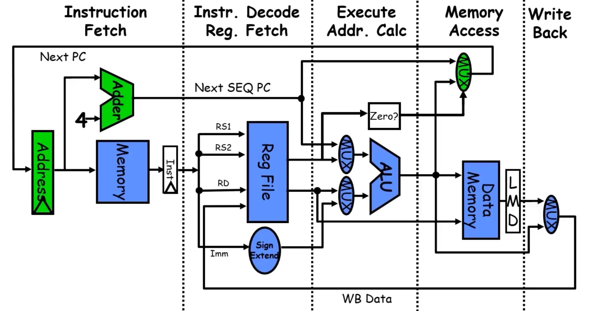
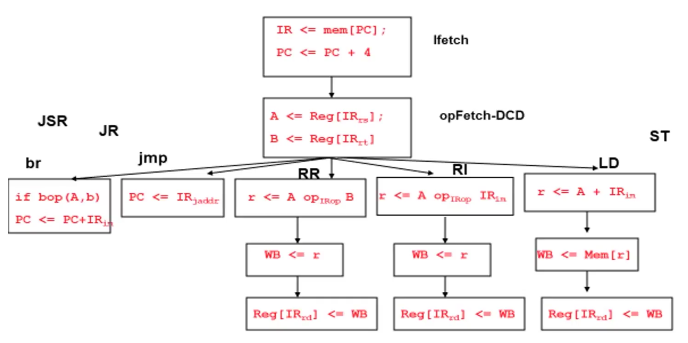
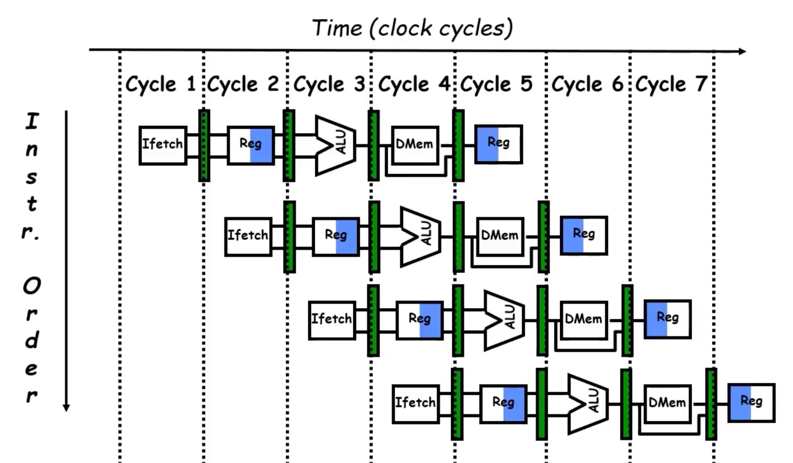

## A "Typical" RISC ISA
- 32-bit fixed format instructions (3 formats)
- 32 32-bit general-purpose registers
- 3-address, reg-reg, arithmetic instructions
- Single address mode for load/store: base + displacement
    - No indirection
- Simple branch conditions
- Delayed branch

---

## Datapath vs Control
### Datapath
- Storage, FU, interconnect sufficient to perform the desired functions
    - Inputs are **Control Points**
    - Outputs are **Signals**

### Controller
- State machine to orchestrate operation on the datapath
    - Based on desired functions and signals

---

## Approaching an ISA
- **Instruction Set Architecture (ISA)**
    - Defines set of operations, instruction format, hardware-supported data types, named storage, addressing modes, sequencing, etc.
    
- Meaning of each instruction is described by **RTL** on architected registers and memory
- Given technology constraints, assemble an adequate datapath:
    - Architected storage mapped to actual storage
    - Functional units (FUs) to do all the required operations
    - Possible additional storage
    - Interconnect to move information among registers and FUs
    - These steps are how to design the **datapath** and prepare to design **control**

- For each instruction:
    - Come up with a sequence of micro-instructions, written in **RTL** (Register Transfer Level)
    - Map each instruction to a sequence of RTLs
    - Collate sequence into symbolic **Controller State Transition Diagram (STD)**
    - Lower symbolic STD to control points
    - Implement the controller

---

## 5 Steps of Datapath



These steps are for an `add` instruction, like:
    
    add r1, r2, r3

- Fast forward to **Instruction Set Processor Controller** to see how the controller stages change
- First 2 stages are always the same

### 1st Stage: Instruction Fetch
```plaintext
IR <= mem[PC];
PC <= PC + 4; // Fixed size, so we know the next instruction will be 4 bytes away (Unless jump/branch)
```

### 2nd Stage: Instruction Decode and Register Fetch
```plaintext
Example:
    - Reg[IR(rd)] <= Reg[IR(rs)] op(IRop) Reg[IR(rt)];

- Extract values from IR(rs) and IR(rt) in the register file
- Perform operation within the IRop register
```

### 3rd Stage: Execute Address Calculation

```plaintext
A <= Reg[IRrs]; // This is base address
B <= Reg[IRrt];
```

### 4th Stage: Memory Access

```plaintext
rslt <= A op(IRop) B;
```

### 5th Stage: Write Back
```plaintext
    - Writes the result back to the register specified in rd

    Example:
        Write_Back <= rslt;
        Reg[IR(rd)] <= Write_Back;
```

### Instruction Set Processor Controller
```plaintext

    br -> Branch
    jmp -> Jump
    RR -> R-type
    RI -> I-type
    LD -> Load

```



### Data Stationary Control
```plaintext
    Local decode for each instruction phase/pipeline stage
    This is how instruction-level parallelism is allowed
```

### Visualization of ISA Pipeline


