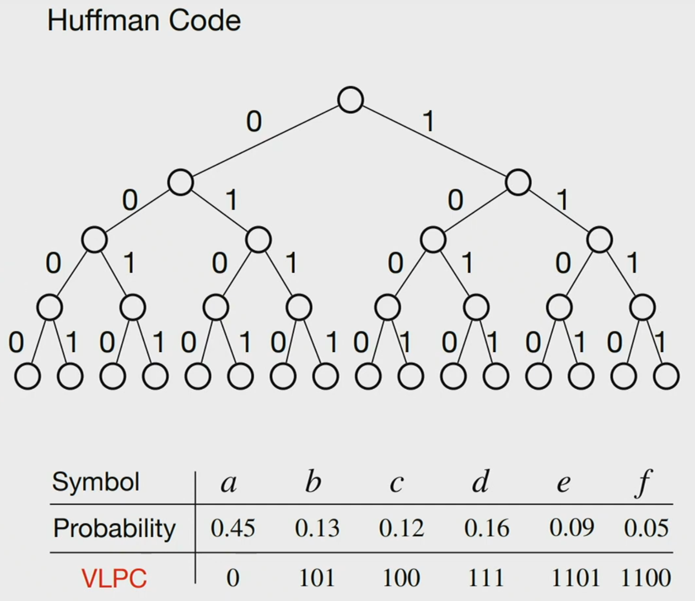
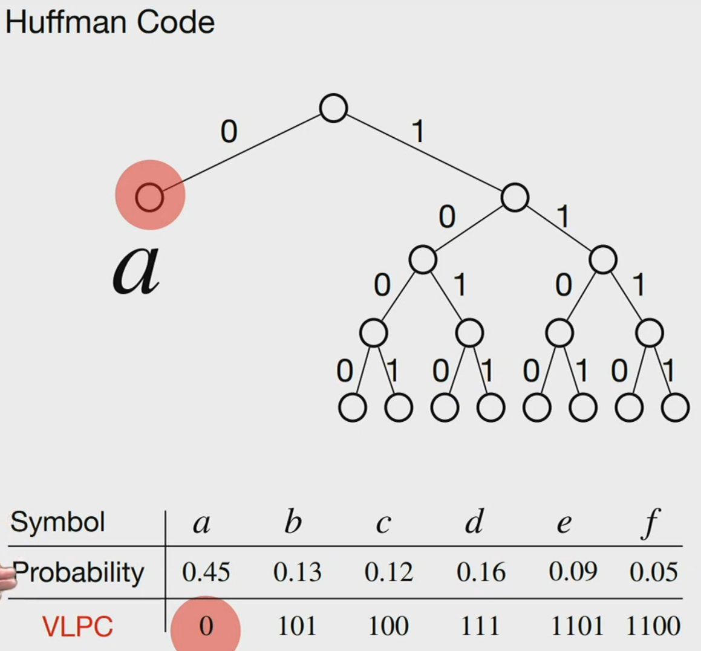
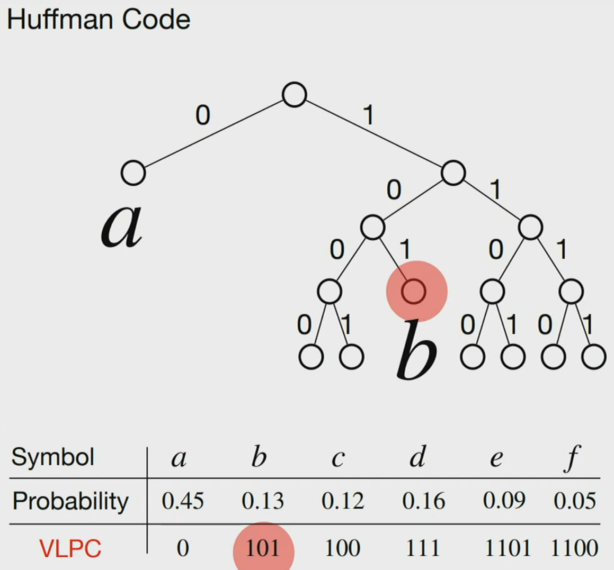
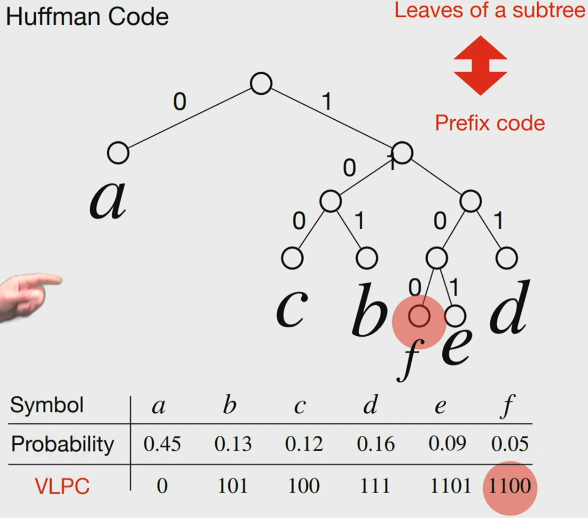

## 3 Understand "Greedy Algorithm" by solving the "Huffman Code Problem"

### 3.1 Define the "Huffman Code Problem"

- How to represent the symbols using bits, to minimize the average number of bits needed?
- If a symbol comes up more often, we use a smaller sequence of bits to represent it.
- The symbol that comes up less often will need a longer sequence of bits.
- We hope the number of bits needed to represent the file is around the average mark.
- Huffman code is one way to do this.
- It's a data compression problem.

| Symbol      |  a   |   b  |   c  |   d  |   e  |  f  |
|-------------|------|------|------|------|------|-----|
| Probability | 0.45 | 0.13 | 0.12 | 0.16 | 0.09 | 0.05 |

- 45% of the symbols in the file are 'a'.
- 13% is 'b', and so on.

**Assume:**

We use "Fixed Length Code (FLC)"  
1-bit codewords: 0, 1 (not enough)  
2-bit codewords: 000, 01, 10, 11 (not enough)  
3-bit codewords: 000, 001, 010, 011, 100, 101, 110, 111 (Enough)

```text
000 -> a 
001 -> b 
010 -> c 
...
```

We will need log<sub>2</sub>(n) bits to represent all possibilities, where n is the length of the array.

| Symbol      |  a   |   b  |   c  |   d  |   e  |  f   |
|-------------|------|------|------|------|------|------|
| Probability | 0.45 | 0.13 | 0.12 | 0.16 | 0.09 | 0.05 |
| FLC         | 000  | 001  | 010  | 011  | 100  | 101  |

#### Compression:
- **AKA**: Encoding
- Turn a text into bits

#### Decompression:
- **AKA**: Decoding
- Turn bits into text

#### Example:

**Text**: `a a b f e d c a ...`

#### Compression using the FLC key:
000 000 001 101 100 011 010 000

#### Decompression:
Since we know the FLC is 3 bits, we look at 3 bits at a time.

000 000 001 101 100 011 010 000 
 a   a   b   f   e   d   c   a

### Variable Length Code (VLC):
- The codewords are of variable length.

### Prefix Code:
- No codeword is the prefix of another codeword.

#### Let's study Variable Length Prefix Code (VLPC).

| Symbol      |  a   |   b  |   c  |   d  |   e  |  f   |
|-------------|------|------|------|------|------|------|
| Probability | 0.45 | 0.13 | 0.12 | 0.16 | 0.09 | 0.05 |
| FLC         | 000  | 001  | 010  | 011  | 100  | 101  | (3 bits per symbol)
| VLPC        |  0   | 101  | 100  | 111  | 1101 | 1100 | (2.24 bits per symbol)

#### Text: `a a b f e d c a`

###$ Compression:
0 0 101 1100 1101 111 100 0

#### Decompression:
- **How do we know why 0 isn't a part of a later symbol's VLPC?**
    - Because of the "no codeword is the prefix of another codeword" rule.
    - Once it gets to `b`, it looks at `1` and `10`, neither of which are in the VLPC. Thus, it gets `101` and sees it corresponds to 'b'.

#### Average codeword length for VLPC:
```plaintext
1 * 0.45 + 3 * 0.13 + 3 * 0.12 + 3 * 0.16 + 4 * 0.09 + 4 * 0.05 = 2.24 bits per symbol
```

### Thus, it's worth the tradeoff compared to 3 bits per symbol with FLC.

---

### The Huffman Code Question:

- **How can we design the VLPC so that the average codeword length is minimized?**
- This is called the **Huffman Code**.

#### Input:
- `n` symbols \( S_1, S_2, \dots, S_n \)
- For \( i = 1, 2, 3, \dots, n \), the symbol \( S_i \) has probability \( F_i \).

#### Output:
- Design a prefix code for the `n` symbols such that the average codeword length is minimized. 
- Assume the codeword for symbol \( S_i \) has \( L_i \) bits.

#### Average Codeword Length:
\[
\sum (F_i L_i) \quad \text{for } i = 1, 2, 3, \dots, n.
\]

### 3.2 Represent a Prefix Code by a Binary Tree

- Every codeword of the VLPC can correspond to a node in the binary tree.

#### Property of Huffman Code Binary Tree:
- The descendants of a node that represents a symbol can't be a valid node because of the **prefix rule**.



- Why? Because if a node below A was valid, that means A would be a prefix of that symbol's VLPC which can't be possible 



Do this for every node, and we get:



Thus mapping all the symbol's VLPC to a tree, then getting rid of the decendants of the nodes with symbols, we get a new entirely different tree 

The leaves of this tree are the symbols of the VLPC 

Depth of a symbol in tree = code word length of that symbol 

Example:
    A is 1 in depth, thus A's codeword length is 1 
    C is 3 in depth, thus C's codeword length is 3 
    F is 4 in depth, thus F;s codeword length is 4 

Thus, if we want to create an output where the codeword length is minimized... it's the same as saying the depth of the leaves of the tree are minimized 

### 3.3 Properties of an Optimal Prefix Code

1. **The symbol with the lowest probability has the longest codeword.**
    - Example: F has the lowest probability \(0.05\) and does have the longest codeword of 4 bits.
    - **Proof**: If not, we can switch its codeword with another symbol and get a better code.

2. **The symbol of the lowest probability and longest codeword has a sibling leaf node.**
    - If it doesn't exist, the node can move up to reduce the codeword length.

3. **There exists an optimal code where the two symbols of the lowest probabilities are siblings.**
    - **Idea**: Combine the two lowest probability symbols into one node and repeat the process.

### 3.4 Example of the Huffman Code Algorithm

| Symbol   | a    | b    | c    | d    | e    | f    |
|----------|------|------|------|------|------|------|
| Probability | 0.45 | 0.13 | 0.12 | 0.16 | 0.09 | 0.05 |

1. **Pick `e` and `f`, combine them into `ef`.**

| Symbol   | a    | b    | c    | d    | ef   |
|----------|------|------|------|------|------|
| Probability | 0.45 | 0.13 | 0.12 | 0.16 | 0.14 |

2. **Pick `b` and `c`, combine them into `bc`.**

| Symbol   | a    | bc   | d    | ef   |
|----------|------|------|------|------|
| Probability | 0.45 | 0.25 | 0.16 | 0.14 |

3. **Pick `d` and `ef`, combine them into `def`.**

| Symbol   | a    | bc   | def  |
|----------|------|------|------|
| Probability | 0.45 | 0.25 | 0.30 |

4. **Pick `bc` and `def`, combine them into `bcdef`.**

| Symbol   | a    | bcdef |
|----------|------|-------|
| Probability | 0.45 | 0.55 |

5. **Finally, pick `a` and `bcdef`, and combine them into siblings.**
