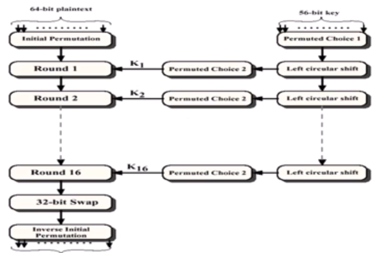
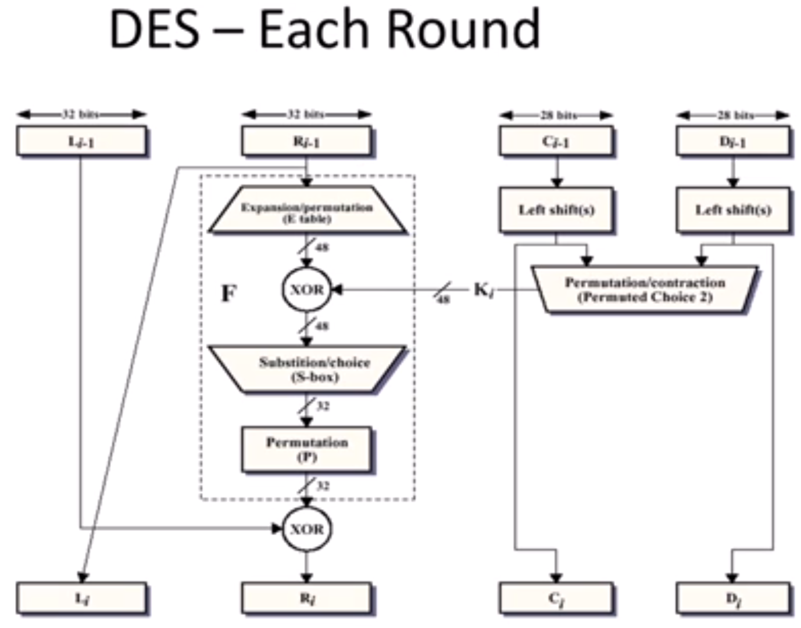

# Block Ciphers and Stream Ciphers

### Block Ciphers
- Partition plaintext into blocks and encrypt each block independently (using the same key) to produce ciphertext blocks.

### Stream Ciphers
- Generate a keystream and encrypt by combining the keystream with the plaintext, usually with the bitwise XOR operation.

> We will focus primarily on **Block Ciphers**.

---

# Modern Block Cipher: DES (Data Encryption Standard)

- DES encrypts using a series of **substitution** and **transposition** operations.
- Based on the **Feistel Structure**.
- It was the worldwide encryption standard for over 20 years.
- Originally designed by IBM (Lucifer) with help from the NSA.
- **No longer considered secure** for highly sensitive applications due to its small key size.
- Replaced by **AES (Advanced Encryption Standard)** because:
  - DES has a key size of only **56 bits**, while the minimum key size for modern encryption is **128 bits**.
  - However, DES can be strengthened through certain techniques.

---

# DES Overview (Block Operation)

1. **Initial Permutation** of the plaintext:
   - Example: 
     - 8th bit becomes 1st bit.
     - 9th bit becomes 21st bit.
     - 42nd bit becomes 3rd bit.

2. A **permuted choice** is applied to the 56-bit key.

3. The key is **shifted** a random amount.

4. **Permuted plaintext** is encoded by the shifted key, resulting in a newly altered plaintext.
   - End of a round.

5. With the original 56-bit key, shift it again a random amount.

6. Encode the newly altered plaintext.

7. Repeat this for a total of **16 rounds** of permutations.

8. Perform a **32-bit swap**.

9. Perform an **inverse initial permutation**:
   - Reverse the initial permutation to restore the order.

10. The result is a **64-bit ciphertext**.

> For each permutation, DES performs a combination of **substitutions** and **transpositions**.

---

# DES Rounds

The mathematical computation performed in each round is:

Here is the markdown version of the content for Block Ciphers, Stream Ciphers, and DES:

markdown

# Block Ciphers and Stream Ciphers

### Block Ciphers
- Partition plaintext into blocks and encrypt each block independently (using the same key) to produce ciphertext blocks.

### Stream Ciphers
- Generate a keystream and encrypt by combining the keystream with the plaintext, usually with the bitwise XOR operation.

> We will focus primarily on **Block Ciphers**.

---

# Modern Block Cipher: DES (Data Encryption Standard)

- DES encrypts using a series of **substitution** and **transposition** operations.
- Based on the **Feistel Structure**.
- It was the worldwide encryption standard for over 20 years.
- Originally designed by IBM (Lucifer) with help from the NSA.
- **No longer considered secure** for highly sensitive applications due to its small key size.
- Replaced by **AES (Advanced Encryption Standard)** because:
  - DES has a key size of only **56 bits**, while the minimum key size for modern encryption is **128 bits**.
  - However, DES can be strengthened through certain techniques.

---

# DES Overview (Block Operation)

1. **Initial Permutation** of the plaintext:
   - Example: 
     - 8th bit becomes 1st bit.
     - 9th bit becomes 21st bit.
     - 42nd bit becomes 3rd bit.

2. A **permuted choice** is applied to the 56-bit key.

3. The key is **shifted** a random amount.

4. **Permuted plaintext** is encoded by the shifted key, resulting in a newly altered plaintext.
   - End of a round.

5. With the original 56-bit key, shift it again a random amount.

6. Encode the newly altered plaintext.

7. Repeat this for a total of **16 rounds** of permutations.

8. Perform a **32-bit swap**.

9. Perform an **inverse initial permutation**:
   - Reverse the initial permutation to restore the order.

10. The result is a **64-bit ciphertext**.

> For each permutation, DES performs a combination of **substitutions** and **transpositions**.

---

# DES Rounds

The mathematical computation performed in each round is:

    Li = R(i-1) 
    Ri = L(i-1) XOR F(Ki, R(i-1))

- **Li**: Left block of the ith round.
- **R(i-1)**: Right block of the (i-1)th round.
- **Ri**: Right block of the ith round.
- **F(Ki, R(i-1))**: A function consisting of a series of **substitutions** and **transpositions**.
- **Ki**: Key for the ith round.

---

# DES Decryption

- Decryption is done using the same encryption algorithm but with a **reversed key schedule**:
  - The final key from encryption becomes the first key in decryption (Key16 -> Key1).

---

# DES Example

### Encryption
- **Plaintext**: `123456ABCD132536`
- **Key**: `AABB09182736CCDD`

1. After **initial permutation**: `14A7D67818CA18AD`.
2. After splitting:
   - `L0 = 14A7D678`
   - `R0 = 18CA18AD`

#### Round 1
- Left: `18CA18AD`
- Right: `5A78E394`
- Key: `194CD072DE8C`

#### Round 2
- Left: `5A78E394`
- Right: `4A1210F6`
- Key: `4568581AABCCE`

#### Round 3
- Left: `4A1210F6`
- Right: `B8089591`
- Key: `06EDA4ACF5B5`

> Continues for 16 rounds, ending with ciphertext: `C0B7A8D05F3A829C`.

### Decryption
- **Ciphertext**: `C0B7A8D05F3A829C`
1. After **initial permutation**: `19BA9212CF26B472`.
2. After splitting:
   - `L0 = 19BA9212`
   - `R0 = CF26B472`

#### Round 1
- Left: `CF26B472`
- Right: `BD2DD2AB`
- Key: `181C5D75C66D`

Skipping to Round 15:
- Left: `5A78E394`
- Right: `18CA18AD`
- Key: `4568581AABCCE` (same as Round 2).

#### Round 16:
- Left: `14A7D678`
- Right: `18CA18AD`
- Key: `194CD072DE8C` (same as Round 1).

> After 16 rounds, the original **plaintext** is recovered: `123456ABCD132536`.

---

# DES Security: Avalanche Effect

### Example:
- **Plaintext**: `0000000000000000`
- **Ciphertext**: `4789FD478E82A5F1`
- **Key**: `22234512987ABB23`

- **Plaintext**: `0000000000000001`
- **Ciphertext**: `0A4ED5C15A63FEA3`

> The difference between the plaintexts is a single bit, but the ciphertexts differ by 29 bits.

- This illustrates the **Avalanche Effect**, where changing the plaintext by 1.5% results in a nearly 45% change in the ciphertext.
- DES exhibits strong security since a minor change in the plaintext significantly alters the output.

---

# Avalanche Effect in DES

Since DES performs 16 rounds of substitutions and transpositions, the collective effect of each round increases the difference between the ciphertexts, demonstrating a strong **Avalanche Effect**.
